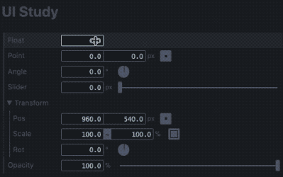

# UI Study



**[Demo](http://s.baku89.com/ui)**

Study of patameter controls UI for creative-purpose softwares. (Such as AfterEffects, Cinema4D)

The motivation of this project is described here: [Study of UI](http://baku89.com/ui)

## Development Environment

### Transpiler languages

 - JavaScript: [TypeScript](https://www.typescriptlang.org/) + [JSX](https://reactjs.org/docs/introducing-jsx.html)
 - HTML: [Pug](https://pugjs.org)
 - CSS: [Stylus](http://stylus-lang.com/)

### Build tools

 - Yarn
 - Gulp
 - Webpack (for only JS)

### To transpile and debug:

```
yarn install
gulp -o
```

## Relating Documents

 - [Classified Table of Parameter Controls](https://docs.google.com/spreadsheets/d/1iyjMUTgJAZhPu4Rg2aV1QPgwSUWBAfuuRCwx0Yki4XM/edit#gid=0)

## License

This repository is published under a MIT License. See the included [LISENCE file](/LICENSE).