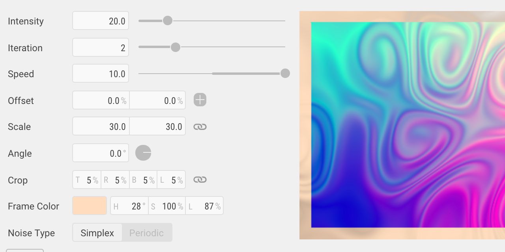

# UI Study



**[Demo](http://ui.baku89.com)**

Study of patameter controls UI for creative-purpose softwares. (Such as AfterEffects, Cinema4D)

The motivation of this project is described here: [Study of UI](http://baku89.com/ui-study)

## Development Environment

### Transpiler languages

- JavaScript: [TypeScript](https://www.typescriptlang.org/)
- CSS: [Stylus](http://stylus-lang.com/)

### Build tools

- Yarn
- Vue CLI 3

### To transpile and debug:

```
yarn install
yarn serve
```

## Relating Documents

- [Classified Table of Parameter Controls](https://docs.google.com/spreadsheets/d/1iyjMUTgJAZhPu4Rg2aV1QPgwSUWBAfuuRCwx0Yki4XM/edit#gid=0)

## License

This repository is published under a MIT License. See the included [LISENCE file](/LICENSE).
